# 서울 기상·전력 시뮬레이터 — 디지털트윈 프로젝트

> El Niño(엘니뇨) 기상 이변이 서울시 전력망에 미치는 영향을 실시간으로 시각화하고 구별 순환정전 시나리오를 시뮬레이션하는 디지털트윈 시스템

[](https://unity.com)
[](https://elninoenergyrisksimulation.duckdns.org/)
[]()
[]()

---

## 📌 프로젝트 개요

서울시 공공 API에서 수집한 **기상·전력 데이터**를 3D 가상 공간에 실시간으로 반영하여, El Niño 기후 변화에 따른 도시 전력 리스크를 시각화하는 **디지털트윈 시뮬레이터**입니다.

| 항목 | 내용 |
|------|------|
| 개발 기간 | 2026.06.22 ~ 2026.07.07 (약 2주) |
| 팀 구성 | 4명 (본인: 렌더링·시뮬레이션·데이터 구조 담당) |
| 빌드 환경 | Unity 6000.3.18f1 / WebGL 배포 |
| 데이터 | 서울시 공공 API (기상, 전력 예비율, 구별 건물 데이터) |

---

## 🎬 시연

### 구 선택 및 건물 스폰 (Lazy Loading)

https://github.com/user-attachments/assets/30b824d8-86dc-4961-bdc4-6c6c07c1b1c0

### 순환정전 시뮬레이션

https://github.com/user-attachments/assets/79c52092-5809-40cc-b108-589bd850f874

> WebGL 빌드 배포 링크: [바로가기](https://elninoenergyrisksimulation.duckdns.org/)

---

## ✨ 주요 기능

### 1. 서울시 25개 구 3D 건물 시각화
- 서울시 건물 공공 데이터 기반으로 구별 건물 메시 생성
- 구 선택 시 해당 구의 3D 건물군이 실시간으로 렌더링

### 2. El Niño 지수(ONI) 기반 에너지 리스크 표시
- ONI 트렌드 데이터를 차트로 시각화
- 구별 전력 예비율을 색상 히트맵으로 표현 (안전 → 위험)

### 3. 순환정전 시뮬레이션
- 전력 예비율 임계값 도달 시 구별 순환정전 시나리오 실행
- 건물 단위 정전 연출 (GPU 버퍼 기반 상태 반영)
- 블랙아웃 게이지 및 예비율 단계 UI 제공

### 4. 미니맵 구별 현황 표시
- 25개 구 경계를 Decal로 렌더링
- 에너지 상태에 따른 구별 색상 실시간 업데이트

---

## 🛠 기술 스택

| 분야 | 사용 기술 |
|------|-----------|
| 엔진 | Unity 6000.3.18f1 (Unity 6) |
| 언어 | C#, C++ |
| 렌더링 | GPU ComputeBuffer, Texture2D, URP Shader, Cesium for Unity, Decal |
| 데이터 | 서울시 공공 API, GeoJSON 스트리밍 파싱, 스트리밍 에셋 |
| 성능 | C++ Native Plugin, Data Baking, Lazy Loading, DOD(Data-Oriented Design) |
| 배포 | WebGL Build |
| 협업 | Git, GitHub, Notion |

---

## 👤 내 담당 파트

팀 4명 중 **렌더링 파이프라인 및 시뮬레이션 로직** 전담

```
├── Core/
│   ├── Objects/         건물·구역 오브젝트 설계 (BuildingObject, DistrictObject)
│   ├── Managers/        DistrictManager, BuildingManager, PowerGridManager
│   └── Simulation/      BlackoutSimulationController — 정전 시뮬레이션 로직
├── Data/
│   ├── DataBaker.cs     빌드 전 메시 데이터 사전 베이킹 시스템
│   ├── DataManager.cs   공공 API 수집 데이터 관리 구조
│   └── DataParser.cs    600MB GeoJSON 스트리밍 파싱
├── Editor/
│   └── BakeTerrainHeightsWindow.cs   베이킹 에디터 툴 (Tools > Bake Terrain Heights)
└── Core/Diagnostics/
    └── WebGLMemoryDiagnostics — WebGL OOM 모니터링
```

---

## 🔄 렌더링 파이프라인

```mermaid
flowchart LR
    subgraph BAKING["빌드 전 · BAKING"]
        GeoJSON["GeoJSON\n600MB 건물 데이터"]
        Parser["DataParser.cs\nJsonTextReader 스트리밍"]
        Baker["DataBaker.cs\n인스턴스 · 폴리곤 베이킹"]
        TerrainBaker["BakeTerrainHeightsWindow.cs\nCesium SampleHeight"]
        DistrictBytes["District.bytes\n건물 위경도 · 높이"]
        PolygonBytes["PolygonData.bytes\n전체 폴리곤 좌표"]
        TerrainBytes["TerrainHeights.bytes\n구별 지형 고도"]

        GeoJSON -->|스트리밍 파싱| Parser
        Parser --> Baker
        Parser --> TerrainBaker
        Baker --> DistrictBytes
        Baker --> PolygonBytes
        TerrainBaker --> TerrainBytes
    end

    subgraph RUNTIME["런타임 · RUNTIME"]
        CPP["SeoulBuildingProcessor · C++ Native Plugin\nBuildDistrictMesh() — EarClipping · 벽면/지붕 생성\nbuildingBuffer + polygonPointsBuffer + terrainHeights"]
        Mesh["Unity Mesh\n구 단위 통합 메시 · 드로우콜 25개 고정\nUV2.x = buildingId 내장"]
        RenderBuf["BuildingRenderData[]\nreductionValue · isBlackout\nC++ 포인터 직접 전달"]
        Tex["Texture2D\nRGHalf · 16384×N\n_BuildingDataTex"]
        Shader["URP Shader\nUV2.x → _BuildingDataTex 샘플링"]
        Output["화면 출력\n히트맵 · 정전 연출"]

        CPP -->|buildingId 각 버텍스에 내장| Mesh
        CPP -->|renderingBuffer| RenderBuf
        RenderBuf --> Tex
        Mesh --> Shader
        Tex --> Shader
        Shader --> Output
    end

    DistrictBytes -->|buildingBuffer| CPP
    PolygonBytes -->|polygonPointsBuffer| CPP
    TerrainBytes -->|NativeArray float| CPP
```



---

## ⚙️ 기술적 도전과 해결

### 문제 1 — 서울시 건물 수만큼 오브젝트를 생성하면 씬이 못버팀

서울시 전체 건물 수를 개별 오브젝트로 생성하면 드로우콜과 메모리가 폭발적으로 증가했습니다.

**해결: 구 단위 메시 통합 + DOD 설계**
- 개별 건물 오브젝트 대신 **구(區) 단위로 25개의 메시 오브젝트**만 생성하여 드로우콜을 고정
- 건물별 상태(`reductionValue`, `isBlackout`)를 게임 오브젝트가 아닌 **`BuildingRenderData` 구조체 배열**로 관리 (DOD)
- C++에서 메시를 생성할 때 각 **버텍스에 `buildingId`를 내장**하여, 셰이더가 어떤 건물의 버텍스인지 식별 가능하도록 설계
- `BuildingRenderData` 배열을 **Texture2D로 인코딩해 URP Shader에 전달**, 셰이더가 버텍스의 `buildingId`로 Texture2D를 샘플링하여 해당 건물의 색상 결정
- `reductionValue`는 공공 API에서 수신한 구별 전력 예비율을 가공해 실시간으로 배열에 반영

---

### 문제 2 — 600MB GeoJSON 파일을 메모리에 올리면 앱이 죽음

서울시 건물 데이터 GeoJSON 파일이 약 **600MB**로, `File.ReadAllText()`로 전체를 한 번에 읽으면 메모리 부족으로 앱이 종료됐습니다.

**해결: 스트리밍 파싱 (`DataParser.cs`)**
- `JsonTextReader`를 활용해 파일을 메모리에 올리지 않고 **스트림으로 한 줄씩 읽는** 방식으로 전환
- `features` 배열만 탐색해 필요한 건물 데이터만 추출, 불필요한 GeoJSON 메타데이터는 읽지 않고 스킵
- 파싱 중 유효하지 않은 폴리곤(크기 2m 미만) 필터링으로 처리 대상 건물 수도 함께 감소

---

### 문제 3 — 런타임 메시 초기화 시간이 3분 소요

구 단위로 줄였음에도 불구하고, 25개 구 전체 메시를 런타임에 계산하면 약 **3분**이 걸렸습니다.

**해결: Data Baking**
- 건물의 위치·높이는 변하지 않는 **정적 데이터**라는 점에 착안
- 빌드 전 에디터 툴로 메시 연산 결과를 `.bytes` 파일로 미리 베이킹하여 스트리밍 에셋에 저장
- 런타임에는 연산 없이 파일을 읽어 메시를 복원
- **결과:** 구당 로딩 2~3초 → 25개 구 전체 **1분 미만**으로 단축

```
[Before] 런타임 메시 연산: ~3분
[After]  베이킹된 .bytes 로드: ~50초
```

베이킹 파일은 총 3종류로 구성됩니다:

```
Resources/Districts/
├── PolygonData.bytes              ← 전체 건물 폴리곤 좌표 (공용)
└── {districtId}/
    ├── District.bytes             ← 건물 인스턴스 데이터 (위경도, 높이, 층수, 구 코드 등)
    └── TerrainHeights.bytes       ← Cesium 지형 높이 (구별)
```

> `TerrainHeights.bytes`는 Cesium의 `SampleHeightMostDetailed`가 실제 지형 타일 로드 상태를 필요로 하기 때문에, 에디터에서 **플레이 모드로 실행한 상태**에서만 베이킹이 가능합니다.

---

### 문제 4 — C++ Native Plugin 도입: EarClipping 삼각분할 성능 확보

서울시 건물은 각기 다른 불규칙 폴리곤 형태를 가지고 있어 메시 생성 시 삼각분할(EarClipping)이 필요합니다. 수만 개의 건물에 대해 C# managed 코드로 EarClipping을 수행하면 속도가 크게 부족했습니다.

**해결: C++ Native Plugin (`SeoulBuildingProcessor.dll`)**
- EarClipping 삼각분할 및 벽면·지붕 메시 생성 연산을 C++ 네이티브 레이어로 이관
- 건물 렌더링 상태(`reductionValue`, `isBlackout`)를 C++ 벡터로 관리하고 **포인터를 직접 ComputeBuffer에 전달**하여 C# GC 개입 최소화
- Cesium에서 측정한 지형 고도(`TerrainHeights.bytes`)를 받아 건물 메시에 실시간 반영

---

### 문제 5 — WebGL 빌드 시 OOM(메모리 초과) 에러

WebGL 환경은 메모리 제한이 엄격해, 25개 구를 모두 스폰하면 OOM 에러가 발생했습니다.

**해결: Lazy Loading + 변수 재사용 (+ C++ Native Plugin 메모리 관리)**
- 앱 시작 시 전체 구를 스폰하지 않고, **현재 선택된 구만 스폰**하는 Lazy Loading 전략 적용
- 메시 처리 시 `new` 할당 반복을 없애고, **미리 생성한 버퍼 변수를 재사용**하도록 리팩터링하여 GC 압박 감소
- C++ 벡터 기반 버퍼 관리로 C# GC 트리거 자체를 줄여 WebGL 환경 안정화에 기여
- `WebGLMemoryDiagnostics`로 런타임 메모리 사용량을 모니터링하며 안정화

---

## 📁 프로젝트 구조

```
SeoulBuildingProcessor/                   ← C++ Native Plugin 소스
├── SeoulBuildingProcessor.cpp            건물 메시 생성, EarClipping 삼각분할, 렌더링 버퍼 관리
├── pch.h                                 프리컴파일 헤더 (Windows)
├── build_webgl.ps1 / build_webgl.sh      WebGL(.a/.o) 빌드 스크립트
└── build_mac.sh                          macOS(.bundle) 빌드 스크립트

Assets/Plugins/                           ← 플랫폼별 빌드 결과물
├── x86_64/SeoulBuildingProcessor.dll     Windows (에디터·스탠드얼론)
├── WebGL/SeoulBuildingProcessor.a/.o     WebGL 정적 라이브러리
└── macOS/SeoulBuildingProcessor.bundle   macOS

Assets/Scripts/
├── Core/
│   ├── Cesium/          Cesium 크레딧 숨김 처리
│   ├── Diagnostics/     WebGL 메모리 진단
│   ├── Managers/        구역·건물·전력망 매니저
│   ├── Objects/         건물·구역 오브젝트
│   └── Simulation/      정전 시뮬레이션, 카메라 컨트롤러
├── Data/
│   ├── Models/          데이터 모델 (구역, 건물, 전력망, 정전)
│   ├── ApiClient.cs     공공 API 통신
│   ├── DataBaker.cs     메시 데이터 베이킹
│   ├── DataManager.cs   데이터 통합 관리
│   └── DataParser.cs    JSON 파싱
├── Editor/
│   └── BakeTerrainHeightsWindow.cs   지형 높이 베이킹 에디터 툴
├── UI/
│   ├── MiniMap/         미니맵 (Decal 기반 구 경계)
│   ├── Panel_Blackout/  정전 게이지 및 예비율 UI
│   ├── Panel_Gu_Energy/ 구별 에너지 현황 패널
│   ├── Panel_ONI_Trend/ ONI 트렌드 차트
│   └── Panel_UserInput/ 날짜 선택 UI
└── Utilities/           좌표 변환, 메시 생성, 컬러맵 등
```

---

## 🔗 관련 링크

- **팀 GitHub:** [JINA1003/SmartCity](https://github.com/JINA1003/SmartCity)
- **WebGL 배포:** [elninoenergyrisksimulation.duckdns.org](https://elninoenergyrisksimulation.duckdns.org/)
- **포트폴리오:** [github.com/byby3534](https://github.com/byby3534)
